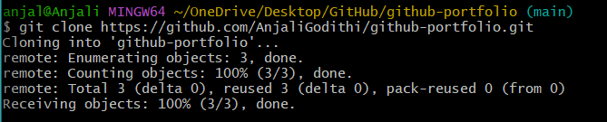

# Lab 01: Enterprise Infrastructure Audit

**Name:** Anjali Godithi  
**Date:** January 28, 2026  
**Status:** Completed  

---

## 🎯 Objective
To analyze the 2021 Facebook outage from an enterprise infrastructure perspective and explain how BGP route withdrawal caused a DNS failure cascade.

---

## 🛠️ Tools Used
- Git Bash (Terminal)
- GitHub (Version control + cloud publishing)
- Markdown (Professional documentation)

---

## 🔍 Key Findings (Case Study)
1. **Root Cause:** Meta’s BGP routes were withdrawn, removing their networks from the public internet.
2. **Cascading Failure:** DNS resolvers could not reach Meta authoritative DNS servers, making services unreachable.
3. **Impact:** Facebook, Instagram, and WhatsApp experienced a global outage, including internal systems.

---

## 💡 Lessons Learned (Enterprise View)
This outage shows how a routing change can become a total service failure. In an enterprise environment, this supports:
- Strict change-control and approval workflows  
- Staged rollouts with rollback plans  
- Out-of-band access for emergency recovery  

---

## 📸 Proof of Work

